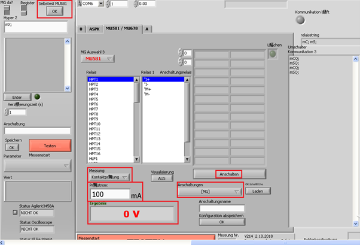
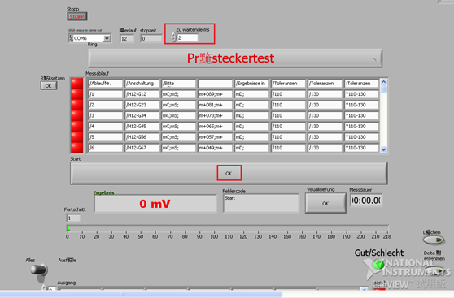
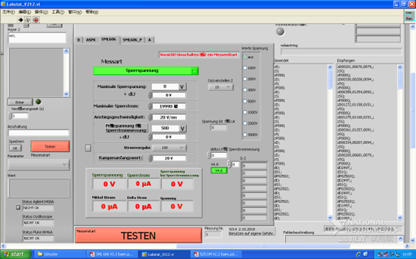
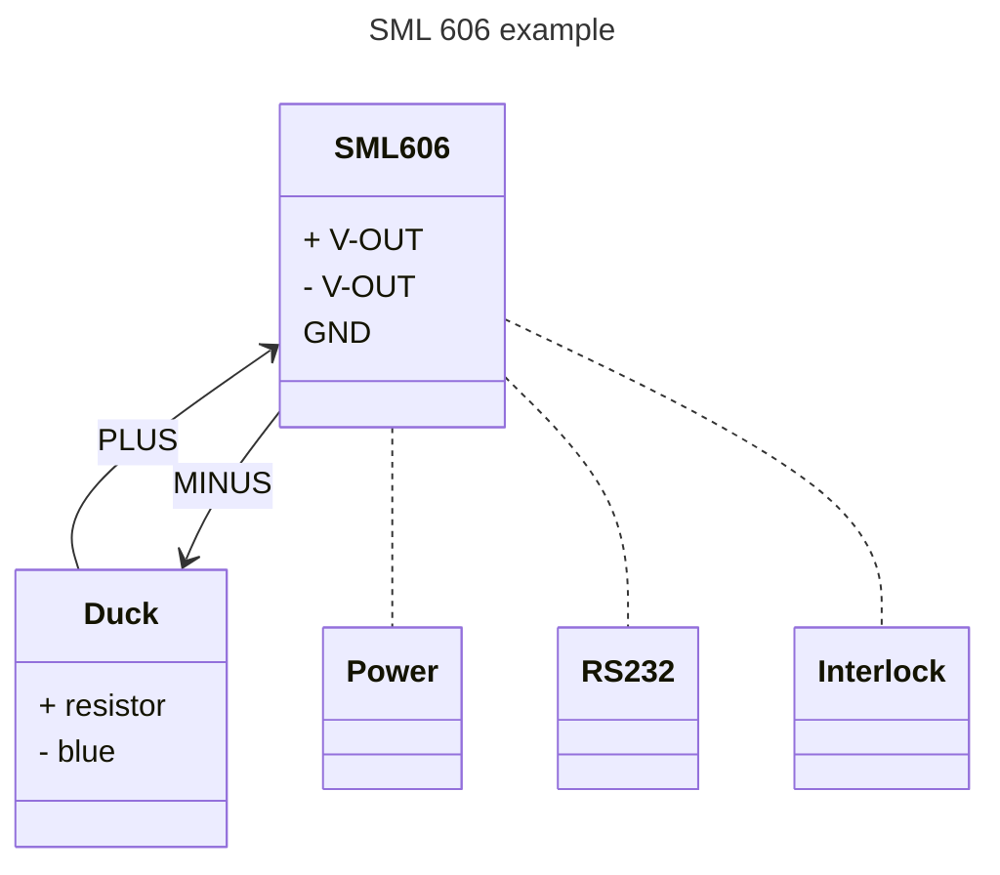

# 仪器校验指南


## __MU581__
### __说明__
#### 仪器说明：
MU581负责Mini SKiiP的VGE(th), Kontakt和Temp。
是由电压源、电流源，电压表和继电器矩阵组成的集成仪器。
#### 测试步骤说明

- Gate voltage：最高可持续输出15V的门级启动电压。
- Test current：可输出最高10A的瞬时电流，同时对自身的输出电流进行测量。
- Test voltage：检查电压测量功能是否正常。
- Self test：接入一个专用夹具，检查所有继电器的接合是否正常。

### __测试前准备__
#### 准备仪器和夹具：
!!! note ""
    待测MU581*1

    MU581共7台，编号分别为2144、2145、2151、2156、2158、2164、2136（SKiiP用）

- 校验专用电脑（包括电脑电源和RS232连接线）
- DC电源*1
- 万用表（电压表+电流表）*1
- 自检接头
- 专用连接线（两条）
- 电源线*2
- 连接线*2

#### 连接
接上电源。用RS232-USB线把电脑和待测仪器相连接。点击Stop后选择正确的COM口，重新启动VI程序，如果能获得如下界面说明成功连接。



### __测试步骤__
#### Gate voltage测试
1. 按照示意图接线

    ```mermaid
    sequenceDiagram
        participant 电压表
        participant MU 581
        participant Power
        participant PC

        MU 581->>电压表: (-) HLF1/2/3
        MU 581->>电压表: (+) VG1/2/3
        MU 581-->>Power: 220VAC
        MU 581-->>PC: USB2232
    ```

2. Gate voltage测试步骤
    - 在“Anschaltungen”下连续选择”MU_Kali”>”Gatespannungsquellen”。
    - 在“Messung”下选择“Kontaktprvfung”。
    - 点击“Anschalten”。
    - 分别测量VG1-HLF1, VG2-HLF2, VG3-HLF3之间的电压，记录该数值。

#### Test current测试
1. Test current按照示意图接线

    ```mermaid
    sequenceDiagram
        participant 电流表
        participant MU 581
        participant Power
        participant PC

        MU 581->>电流表: (-) HPT1
        MU 581->>电流表: (+) HPT2
        MU 581-->>Power: 220VAC
        MU 581-->>PC: USB2232
    ```

2. Test current测试步骤
    - 在“Anschaltungen”下选择”MU_Kali”>MU_Strom”。
    - 在“Messung”下选择“Widerstandsmess”。
    - 点击“Anschalten”。
    - “Prvfrstrom”下输入校验表所需的电流值。
    - 电流表连接HPT1-HPT2。注意电流表的量程要与测试电流相匹配。
    - 点击”TESTEN”。记录所得电流。
    - 重复以上步骤测试校验表上要求的所有数值。

#### Test voltage测试
1. Test voltage按照示意图接线

    ```mermaid
    sequenceDiagram
        participant DC电源
        participant MU 581
        participant Power
        participant PC

        DC电源->>MU 581: (-) MA2
        DC电源->>MU 581: (+) MA1
        MU 581-->>Power: 220VAC
        MU 581-->>PC: USB2232
    ```
 
2. Test voltage测试步骤
    - 在“Anschaltungen”下选择”MU_Kali”>MU_Spannung”。
    - 在“Messung”下选择“Spannungmessung”。
    - 给MA1-MA2接入DC电源，打开电压输入。
    - 点击”TESTEN”。将“Ergebnis”下的电压值记录。
    - 重复以上步骤测试校验表上要求的所有数值。
#### Self test测试
1. Self test按照示意图接线

    ```mermaid
    sequenceDiagram
        participant 自检接头
        participant MU 581
        participant Power
        participant PC

        自检接头->>MU 581: 插上去
        MU 581-->>Power: 220VAC
        MU 581-->>PC: USB2232
    ```

2. Self test测试步骤
    - 点击软件面板selftest的“OK”键。进入自检界面。
        
    - 将Zu wartende ms的时间改成3。
    - 点击OK，等待自检完成，可以从下面的进度条查看进度。

## __SML606__
### __说明__
#### 仪器说明：
SML606是一个能够输出最高3000V瞬时电压的恒压源，能够测量自身的输出电压和电流大小，还能够设置最大电流保护。通过MU581连接产品测试BVCES和ICES。该机器的输出有“Sperrspannung”和“Sperrstrom”两种模式，BVCES使用 “Sperrspannung”模式进行测试，该模式可以控制电压的上升时间。ICES使用“Sperrstrom”进行测试，该模式可以测试当前电压输出下的电流大小。

#### 测试步骤说明
- Test Voltage ：检查“Sperrspannung”模式下的输出电压。
- Voltage Rise：检查“Sperrspannung”模式下的输出电压上升时间。
- Reverse Current：检查“Sperrstrom”模式下的电压输出以及电流测量功能。
- Voltage under XX current：检查“Sperrstrom”模式下的电压测量功能。
- FI current failure protection：漏电保护。

### __测试前准备__
#### 准备仪器和夹具：
!!! NOTE ""
    待测SML606*1
    
    SML606共6台，编号为2147、2153、2157、2160、2167、2134（SKiiP）、2166（SML673，用于RTT

- 校验专用电脑（包括电脑电源和RS232连接线）*1
- 万用表（电压表+电流表）*2
- 示波器*1
- 差分探头*1
- 电阻盒（Prvfspannung 500V）*1
- 安全头（interlock）*1
- 电源线*3
- 连接线*5

#### 连接
1. 给SML606接上电源和安全插头（interlock）。
1. 用RS232-USB线把电脑和待测仪器相连接。点击Stop后选择正确的COM口，重新启动VI程序，如果能获得如下界面说明成功连接。
    
    

### 测试步骤
#### Test Voltage 和voltage rise电压测试
1. 按照示意图接线

    ```mermaid
    sequenceDiagram
        title: "Sperrstrom"模式下的电压输出 
        participant 示波器
        participant 差分探头
        participant SML 606
        participant Power
        participant PC
        participant Interlock plug


        示波器->>差分探头: BNC
        SML 606->>差分探头: (+)
        SML 606->>差分探头: (-)
        SML 606-->>Power: 220VAC
        SML 606-->>PC: USB2232
        SML 606-->>Interlock plug: 插入安全头
        SML 606-->示波器: 连接地点
    ```

    将示波器和SML606共地，可减小ripple。

1. Test voltage测试步骤
       - 将Messart设置为Sperrspannung
       - Maximater Sperrstrom 设置为19999
       - 将按照测试表所要求的数值填入Maximater Sperrspanung（数值为选择的数值+/-“dU），后点击TESTEN。
       - 从示波器中测量数值并记录数值。
       - 重复前两步直到校验表所要求的数值全部完成，并且记录到测试表上。测试不同的数值要根据实际调整示波器触发范围的大小。

2. Voltage rise测试步骤
       - 其他测试步骤与test voltage相同
       - 调整anstiegsgeschwindigkeit的大小获得不同的数值。

#### Reverse Current和Voltage under XX current电流测试
1. Reverse Current按照示意图接线

    ```mermaid
    sequenceDiagram
        participant 电阻盒
        participant 电流表
        participant SML 606
        participant Power
        participant PC
        participant Interlock plug


        电阻盒->>电流表: 
        电流表->>SML 606: (-)
        SML 606->>电阻盒: (+)
        SML 606-->>Power: 220VAC
        SML 606-->>PC: USB2232
        SML 606-->>Interlock plug: 插入安全头
    ```

2. Reverse Current测试步骤
    - 将Messart设置为Sperrspannung-Sperrstrom
    - Maximater Sperrstrom 设置为19999
    - 设置正确的stromvorgabe量程。
    - 按照测试表所要求的数值接入电阻盒对应的插孔， Maximater Sperrspanung填0，和Maximater Sperrstrommessung（数值为选择的数值+/-“dU），后点击TESTEN。

    > 例子：要测试1mA的电流,可以选择100k的电阻，设置输出电压为100V,察看电流表的电流值是否符合。

    参考表：

    | 电流(uA) | 电阻(kΩ) | 电压(V) | :material-book: | 电流(mA) | 电阻(kΩ) | 电压(V) |
    | -------- | -------- | ------- |: --- :| -------- | -------- | ------- |
    | 4        | 2500     | 100     | :material-circle: | 0.4      | 500      | 200     |
    | 18       | 2500     | 450     | :material-circle:    | 1        | 500      | 500     |
    | 20       | 2500     | 500     | :material-circle:    | 1.6(1.5) | 333.3    | 500     |
    | 40       | 500      | 20      |  :material-circle:   | 3.6      | 125      | 450     |
    | 50(60)   | 500      | 30      |  :material-circle:   | 7        | 50       | 350     |
    | 200      | 500      | 100     |  :material-circle:   | 14       | 10       | 140     |

      - 从电流表中测量数值并记录数值。
      - 重复前两步直到校验表所要求的数值全部完成，并且记录到测试表上。


3. Voltage under XX current接线示意图

    ```mermaid
    sequenceDiagram
        participant 电阻盒
        participant 电流表
        participant 电压表
        participant SML 606
        participant Power
        participant PC
        participant Interlock plug

        电阻盒->>电流表: 
        电流表->>SML 606: (-)
        电压表-->>SML 606: (-)
        电压表-->>SML 606: (+)
        SML 606->>电阻盒: (+)
        SML 606-->>Power: 220VAC
        SML 606-->>PC: USB2232
        SML 606-->>Interlock plug: 插入安全头
    ```

4. Voltage under XX current测试步骤
      - 测试步骤大致与Reverse Current相同，电压设置固定为500V.
      - 按照测试表所要求的数值接入电阻盒对应的插孔，点击TESTEN。将电压表的数值填入表中。重复该步骤直到完成所有数值。

#### FI current failureprotection漏电保护测试
1. 接线示意图



    图不正确，要串联电流表。

1. FI current failureprotection测试步骤
    - 在2.2.5.的设置基础上点击TESTEN。
    - 检查机器是否有蜂鸣声，记录软件面板上的Sprrstrom的数值。
    - 按下FI-reset，重置报警器。

## DM525
### 说明
#### 仪器说明
DM525是一台最高瞬时输出电流为500A的恒流源，可以测量自身的输出电压和电流大小。通过MU581连接产品测试VCERV(Diode正向导通压降)和VCEsat（IGBT正向导通压降）。
#### 测试步骤说明
1. On-state current ：检查输出电流。
1. On-state voltage：检查电压测量
1. Ignition current control 
### 测试前准备
#### 准备仪器和夹具：
待测DM525*1（一共5台，编号为2146、2152、2159、2135（SKiiP），1台未编号（暂定2168））
校验专用电脑（包括电脑电源和RS232连接线）*1
示波器*1
DC电源
隔离变压器（不使用测试结果会偏高）
1mΩ电阻（TE-CN-1002）
DM525专用测试线
BNC线
电源线*3（尽可能使用接地线）
连接线*5
夹子*2
#### 连接
给DM525通过隔离变压器接上电源和DM525专用测试线。
DM525专用线中的ANODE（HPT1）和CATHODE（HPT3）分别与1mΩ的电阻正负极相连。
用RS232-USB线把电脑和待测仪器相连接。点击Stop后选择正确的COM口，重新启动VI程序，如果能获得如下界面说明成功连接。
 
### 测试步骤
#### On-state current测试
1. 按照示意图接线
 
1. 示波器设置
CH1设置为电流测试（current）模式，探头设置为1000A/V。
将Trigger设置为normal，根据实际测试调整触发大小。
1. On-state current测试步骤
机器前面板的硬件拨钮打到AUTO。将Werte StromDM525设置为校验表所要求的数值，点击TESTEN。通过示波器测量波形的高度得到电流值。需要不断调整CH1的量程。
#### On-state voltage测试
1. On-state voltage按照示意图接线
 
1. On-state voltage测试步骤
机器前面板的硬件拨钮打到AUTO, Werte Strom设置25A。将DM525的电源（I-）与CATHODE（HPT3）共地。按照测试表的数值设置DC电源，点击TESTEN。记录软件面板上Durchlassspannung所显示DM525测得的数值。
#### Ignition current control漏电保护测试
1. 接线示意图
与On-state voltage按照示意图接线相同。
1. Ignition current control测试步骤
机器前面板的硬件拨钮打到AUTO ,Werte Strom设置25A，DC电源设置为2V。在软件面板的Gatestrom设置不同的电流值，观察软件面板上的电压是否稳定。
## LCM625
### 说明
#### 仪器说明
LCM625是一台输出-30V~30V的恒压源，能够测试自身的输出电压，同时时能够检测自身nA级别输出电流。通过MU581连接产品测试IGES。
#### 测试步骤说明
1. Test voltage 
1. Leakage current
### 测试前准备
#### 准备仪器和夹具：
待测LM625*1（共2台，编号为2148、2161，2133（SKiIP））
校验专用电脑（包括电脑电源和RS232连接线）*1
万用表（电压表）*1
1GΩ电阻*1
电阻盒（Prvfspannung 500V）*1
Leakage current线
电源线*2（尽可能使用接地线）
连接线*2
#### 连接
给LM625接上电源。用RS232-USB线把电脑和待测仪器相连接。点击Stop后选择正确的COM口，重新启动VI程序，如果能获得如下界面说明成功连接。
 
### 测试步骤
#### Test voltage测试
1. 按照示意图接线
 
1. Test voltage 测试步骤
将电压表设置为记录peak值的模式。按照校验表在Prvspannung选择电压的绝对值，在polarit-ausgangsspannung选择正负，点击TESTEN。在校验表上记录软件面板和电压表的电压值。
重复以上步骤直到完成校验表上要求的所有数值。
#### Leakage current测试
1. Leakage current按照示意图接线
 
1. Test voltage测试步骤
根据校验表上的值选择电阻盒上对应的插孔并在软件面板上设置对应的电压，点击TESTEN。记录软件面板上的数值。
有些校验表的数值没有对应的电阻盒插孔，选择阻值最接近的一个插孔，再用U1/R1=U2/R2换算得出所需要设置的电压值，测出并记录该电流值。
重复以上步骤直到完成校验表上的所有值。
实际上并没有测量1uA以下电流的条件，校验表就直接写数值。
测试时需要将测试时间调的更长（默认是30ms。可调为600ms）
## ZH525
### 说明
#### 仪器说明
用于测试晶闸管的性能。能够驱动晶闸管瞬时开通和关断，同时测量触发电压、触发电流和维持电流。通过MU581连接某些有晶闸管的产品进行测试。
#### 测试步骤说明
### 测试前准备
#### 准备仪器和夹具：
待测ZH525*1（共2台，编号为2149、2154）
校验专用电脑（包括电脑电源和RS232连接线）*1
ZH525连接线
电源线*1（尽可能使用接地线）
Thyristorbox测试盒
#### 连接
给ZH525接上电源。用RS232-USB线把电脑和待测仪器相连接。点击Stop后选择正确的COM口，重新启动VI程序，如果能获得如下界面说明成功连接。
 
### 测试步骤
#### 测试
1. 按照示意图接线
 
1. 测试步骤
Thyristorbox共有四列插孔。将ZH525专用线的三根线分别插在盒子的对应1、2、3、4列。在软件面板上按照校验表来设置对应的数值，点击TESTEN。记录实际的数值到校验表上。
校验表上的WOP不需要动，是测试的标准参考值。
## IP630
### 说明
#### 仪器说明
绝缘测试仪。输出最高5000V，能够测量自身的输出电压和电流。
#### 测试步骤说明
### 测试前准备
#### 准备仪器和夹具：
待测IP630*1（共3台，编号为2150、2155，2165）
测试专用电脑（vi版本用117和208，212不能用）
Insulation tester calibration测试盒
安全头（interlock）
专用绝缘线（红色）
万用表*1
分压器*1
电源线*2（尽可能使用接地线）
#### 连接
给IP630接上电源。用RS232-USB线把电脑和待测仪器相连接。点击Stop后选择正确的COM口，重新启动VI程序，如果能获得如下界面说明成功连接。
 

### 测试
#### Current测试
1. 按照示意图接线
 
将IP630的HS1和地线，测试盒，电流表串联在一起。
1. 测试步骤
设置Imax1/2和Imin1/2分别为5mA和0.01mA。
电压(ISO-Spannung1/2)设置为2000。
时间设置为3秒。如果不希望测试M1或者M2的某一项，可以将时间设置为0.1s。
也可采用同时测试的方法，但是要密切观察电流表的值。
测试盒有六个孔洞，分别接入进行测试，将电流表和软件面板所示的值纪录。
#### Voltage测试
1. 按照示意图接线
 
将IP630的HS1和地线，分压器串联在一起。用电压表交流档测试分压器的输出电压。
1. 测试步骤
设置Imax1/2和Imin1/2分别为5mA和0.01mA。
时间设置为3秒。如果不希望测试M1或者M2的某一项，可以将时间设置为0.1s。
也可采用同时测试的方法，但是要密切观察电压表的值。
将校验表的电压值分别进行测试，记录电压表和软件面板所得的值。
#### Current M2测试
同M1。
#### Voltage M2测试
同M1。


## Function Tester
### 说明
#### 仪器说明
FT测试站：工作时会在变换电路中测试整流、逆变、斩波的电流、电压和温度状态。所以校验时使用样机对其的电流、电压、温度进行测量，检查是否出现漂移。
### 测试前准备
#### 准备仪器和夹具：
FT测试站（2178）
FT专用夹具1（25230530）
FT专用夹具2（25232930）
专用夹具对应的样机（SKiiP 25230530*6 + SKiiP 25232930*5）
temperature测试盒（PTC和NTC）
示波器*1
万用表*1 （建议用Fluke 287）
BNC线*3
万用表连接线*2（不够长需要桥接）
电源线 （示波器用）
#### 连接
## 停下正在运行的测试线，将现有夹具拆下，将工作站内测试位的产品放在某处妥善保管，完成校验后须放回工作站测试位。
## 进入service模式
软件界面如图操作：点击change user ，输入密码“service”，点击“service”，进入service模式。然后点击右下角的“Manual mode”按钮，进入到手动操作模式。
 
## 测试线FT工位的service按钮应处于以下状态，service mode的灯亮起。
 
## FT工位与夹具连接的参考图：
 
### 测试
测试步骤参考文件“FTMini5_KalibrierArt-Erg_191107.doc”。
将测试结果写在：”MiniSKiiP_Calibration”上。
#### 根据参考文件在“Article parameter”界面的左上角选择所需测试数据对应的配置参数号，然后点击HW Typechange加载。
 
#### 回到testing procedure界面，点击左下角的“start”进行测试，通过示波器（电流、频率）和电压表（DC电压）读取相应的数值。
## DM678
### 说明
#### 仪器说明：
DM678负责RTT的VCERV,VCEsat,VGE(th), Kontakt和Temp。
是由电压源、电流源，电压表和继电器矩阵组成的集成仪器。
可以看作MU581和DM525的合体。
#### 测试步骤说明
1. Forward current：DM部分可输出最高2000A的瞬时电流，同时对自身的输出电流进行测量。
1. Forward voltage：DM部分输出电流时电压是否稳定输出。
1. Ignition current control：DM部分检查电压测量功能是否正常。
1. Ignition voltage：DM部分最高可持续输出15V的门级启动电压。
1. MU test current：MU部分输出电压最高10A.
1. Voltage measurement at measuring connections：MU部分可以测量电压。
1. Self test：接入一个专用夹具，检查所有继电器的接合是否正常。
### 测试前准备
#### 准备仪器和夹具：
待测DM678*1（MU581共2台，编号分别为2182和2163（已损坏））
校验专用电脑（包括电脑电源和RS232连接线）
示波器*1
万用表（电压表+电流表）*1
DC电源*1
MD678专用自检接头
MU581专用连接线（两条）
DM789专用线（HPT1和HPT2接口）
电源线*4
连接线*2
DC电源
隔离变压器（接排插，排插接DM678和示波器，不使用测试结果会偏高）
1mΩ电阻（TE-CN-1002）
BNC线*1
电源线*3（必须使用接地线）
连接线*5
夹子*2

#### 连接
接上电源。用RS232-USB线把电脑和待测仪器相连接。点击Stop后选择正确的COM口，重新启动VI程序，如果能获得如下界面说明成功连接。
 
然后MG Auswahl3 要选择”MU678”。
 
测试时根据不同的测试项目，在“Anschaltungen”和“Messung”选项卡需要选择与图片所示对应的项目进行测试，并点击Anschalten加载，③会显示输入的继电器号码，④返回数据说明对应继电器已经吸合，可以开始测试。

### 测试步骤
#### Self test
    按照示意图接线
 
将DM678自检接口接在DM678上。
在⑧命令输入框输入“tD”，机器开始自动检测，会有继电器接合的响声。测试结束后会返回“tD0”，如果是别的结果，说明有接口故障，需要检查。
接下来可以按照以下推荐顺序测试，可以节省小部分重新接线的时间：
Forward current(小电流) -- MU test current -- Forward voltage -- Voltage measurement at measuring connections -- Forward current(大电流) -- Ignition current control -- Ignition voltage
#### Forward current测试 
按照示意图接线
DM678专用线插在HPT1和HPT2口。另一端在测小电流时，用夹子夹住串联电流表。
 
测大电流时，接在1mΩ电阻上，通过示波器进行测量。
 

在MU581/MU678界面下，在“Anschaltungen”下选择”DM678 Strom/Spannung”。然后点击“Anschalten”。
切换到DM678界面。在Messstrom下根据表格更改电压值，记录面板和电流表/示波器显示的值。
#### Forward voltage测试
按照示意图接线
 
使用MU581专用测试线将LPT1和LPT2接口接在DC电源的两端。
在MU581/MU678界面下，在“Anschaltungen”下选择”DM678 Strom/Spannung”。然后点击“Anschalten”。
切换到DM678界面。调节DC电源输入，点击DM678界面的“TESTEN“按钮，将DC电源和界面”Durchlassspannung”显示的值记录到校验表中。
#### Ignition current control测试
按照示意图接线
 
在MU581/MU678界面下，在“Anschaltungen”下选择”DM678 Strom/Spannung/Zuend”。然后点击“Anschalten”。
切换到DM678界面。根据校验表调节Gatestrom的数值，记录电流表所测的值。
#### Ignition voltage测试
根据示意图接线
 
在MU581/MU678界面下，在“Anschaltungen”下选择”DM678 Strom/Spannung/Zuend”。然后点击“Anschalten”。
切换到DM678界面。Gatestrom的数值设置为100A，根据校验表调节Gatespannung的值，记录电压表所测的值。
#### MU test current测试
根据示意图接线
 
在MU581/MU678界面下，在“Anschaltungen”下选择”MU678 Strom”。在“Messung”下选择“Widerstandsmess”。点击“Anschalten”。
“Prvfrstrom”下输入校验表所需的电流值。注意电流表的量程要匹配。
#### Voltage measurement at measuring connections测试
根据示意图接线
 
在MU581/MU678界面下，在“Anschaltungen”下选择”MU678 Spannung”。在“Messung”下选择“Spannungsmessung”。点击“Anschalten”。
用DC电源给LPT1和LPT2供电。每改变一次电压都需要点击TESTEN，记录DC电源的供电值和“Ergebnis”下显示的值。
#### 
